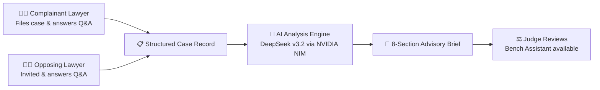

<p align="center">
  
  
  
  
  
  
</p>

<h1 align="center">न्याय · Nyāya</h1>
<p align="center"><strong>AI-Assisted Case Analysis for Indian Consumer Disputes</strong></p>
<p align="center"><em>Clarity for the bench. Structure for the bar.</em></p>

---

> **⚠️ ADVISORY ONLY — NOT LEGAL ADVICE**
>
> Nyāya produces structured analysis to assist human review. It does **not** render verdicts, replace legal counsel, or substitute for judicial reasoning. This is an independent academic project by a VIT-AP student; it is not affiliated with any court, bar council, or government body.

---

## 📋 Table of Contents

- [The Problem](#-the-problem)
- [The Solution](#-the-solution)
- [Key Features](#-key-features)
- [System Architecture](#-system-architecture)
- [Tech Stack](#-tech-stack)
- [Project Structure](#-project-structure)
- [Getting Started](#-getting-started)
- [Environment Variables](#-environment-variables)
- [Deployment to Vercel](#-deployment-to-vercel)
- [Case Categories](#-case-categories)
- [How It Works](#-how-it-works)
- [Design Principles](#-design-principles)
- [Contributing](#-contributing)
- [License](#-license)

---

## 🔍 The Problem

Consumer district commissions in India face immense backlogs:

| Challenge | Impact |
|-----------|--------|
| **Unstructured submissions** | Each party files material in a different format — no enforced schema ensures both sides address the same core questions |
| **Cognitive load on judges** | Judges spend significant time manually synthesizing scattered arguments, identifying disputed facts, and locating applicable precedents |
| **Slow disposal times** | The CPA 2019 targets timely disposal, but many commissions struggle to meet statutory timelines |

No neutral structuring layer exists between lawyers and judges.

---

## 💡 The Solution

**Nyāya** is a neutral case-structuring layer that sits between counsel and the bench:

- **For Lawyers** → Guided question flows aligned to the Consumer Protection Act (CPA) 2019 ensure nothing is missed in submissions
- **For Judges** → An 8-part advisory brief highlighting agreed facts, disputed claims, applicable law, and relevant precedents — entirely traceable to source inputs
- **For the System** → Zero autonomous decision-making. No verdict generation. Explicit caveats on every output.

---

## ✨ Key Features

### Role-Based Workspaces
- **Lawyer Dashboard** — File new cases, complete guided Q&A sessions, upload supporting documents, track case status
- **Judge Dashboard** — View assigned cases, read AI-generated analysis briefs, ask follow-up questions via Bench Assistant, acknowledge reviews

### Dynamic Legal Scaffolding
- Hardcoded CPA case categories (Defective Goods, Deficient Services, Unfair Trade Practices, E-commerce Disputes, Misleading Advertisements, Medical Negligence)
- Each category maps to curated evidentiary questions for both complainant and opposing counsel

### AI Analysis Brief (8 Sections)
1. **Case Summary** — Neutral overview of the dispute
2. **Agreed Facts** — Points both sides concur on
3. **Disputed Facts** — Side-by-side comparison of each party's position
4. **Applicable Law** — Relevant statutes and sections from CPA 2019
5. **Cited Precedents** — From a curated, verified set (no hallucinated citations)
6. **Procedural Flags** — Limitation, jurisdiction, or procedural issues
7. **Evidentiary Gaps** — Missing evidence or unanswered questions
8. **Caveats** — Explicit disclaimers and confidence scoring

### Judge Bench Assistant
- Interactive Q&A powered by DeepSeek v3.2 for case-specific synthesis
- Grounded only in submitted material — never fabricates

### Full Traceability & Audit
- Every AI claim traces back to raw lawyer submissions or certified precedents
- Audit logging for all user actions

---

## 🏗 System Architecture

```
┌───────────────────────────────────────────────────────────┐
│                     Client (Browser)                       │
│  Next.js 15 App Router  ·  React 19  ·  Tailwind v4       │
│  shadcn/ui  ·  Lucide Icons                               │
└──────────────┬──────────────────────┬─────────────────────┘
               │                      │
               ▼                      ▼
┌──────────────────────┐  ┌─────────────────────────────────┐
│   NextAuth v5 Beta   │  │      Convex (BaaS)              │
│  ┌────────────────┐  │  │  ┌────────────────────────────┐ │
│  │ Google OAuth   │  │  │  │  Realtime Database          │ │
│  │ Credentials    │  │  │  │  Serverless Functions        │ │
│  │ (bcrypt hash)  │  │  │  │  Vector Search (768-dim)     │ │
│  └────────────────┘  │  │  │  File Storage                │ │
└──────────────────────┘  │  └────────────────────────────┘ │
                          └──────────┬──────────────────────┘
                                     │
                                     ▼
                          ┌─────────────────────┐
                          │   NVIDIA NIM API     │
                          │   DeepSeek v3.2      │
                          │   (JSON-enforced)    │
                          └─────────────────────┘
```

---

## 🛠 Tech Stack

| Layer | Technology | Purpose |
|-------|-----------|---------|
| **Framework** | [Next.js 15](https://nextjs.org/) (App Router + Turbopack) | Server components, API routes, SSR |
| **UI** | [React 19](https://react.dev/) | Component rendering |
| **Styling** | [Tailwind CSS v4](https://tailwindcss.com/) + [shadcn/ui](https://ui.shadcn.com/) | Design system |
| **Database** | [Convex](https://convex.dev/) | Realtime DB, serverless functions, vector search, file storage |
| **LLM** | [NVIDIA NIM](https://build.nvidia.com/) (DeepSeek v3.2) | Brief generation, judge synthesis, JSON-enforced outputs |
| **Auth** | [Auth.js v5 beta](https://authjs.dev/) | Google OAuth + email/password credentials |
| **Validation** | [Zod](https://zod.dev/) | Runtime type checking |
| **Icons** | [Lucide React](https://lucide.dev/) | SVG icon library |

---

## 📁 Project Structure

```
ai.judge/
├── README.md                  ← You are here
├── CourtroomSimulation.jsx     ← Standalone courtroom simulation component
└── nyaya/                     ← Main Next.js application
    ├── app/
    │   ├── (marketing)/       ← Landing page
    │   ├── (auth)/            ← Sign-in / Sign-up pages
    │   ├── (app)/             ← Authenticated app
    │   │   ├── lawyer/        ← Lawyer dashboard & case management
    │   │   └── judge/         ← Judge dashboard & brief review
    │   └── api/
    │       └── auth/          ← NextAuth routes + registration
    ├── components/ui/         ← shadcn/ui components
    ├── convex/                ← Backend (Convex)
    │   ├── schema.ts          ← Database schema (7 tables)
    │   ├── cases.ts           ← Case CRUD operations
    │   ├── qa.ts              ← Q&A session management
    │   ├── analysis.ts        ← Brief generation orchestration
    │   ├── judge.ts           ← Judge-specific queries
    │   ├── precedents.ts      ← Precedent management & vector search
    │   ├── users.ts           ← User management
    │   └── audit.ts           ← Audit logging
    ├── lib/
    │   ├── auth.ts            ← NextAuth configuration
    │   ├── llm.ts             ← NVIDIA NIM / DeepSeek integration
    │   ├── caseCategories.ts  ← CPA categories & question templates
    │   ├── prompts/           ← LLM system prompts
    │   └── seedData/          ← Precedent seed data
    └── docs/                  ← Documentation
```

---

## 🚀 Getting Started

### Prerequisites

- **Node.js** ≥ 18.17
- **pnpm** (recommended) or npm
- [NVIDIA API Key](https://build.nvidia.com/) for DeepSeek v3.2
- [Convex account](https://dashboard.convex.dev)

### 1. Clone & Install

```bash
git clone https://github.com/Nipunjaiswal442/ai.judge.git
cd ai.judge/nyaya
pnpm install
```

### 2. Configure Environment

```bash
cp .env.example .env.local
```

Populate `.env.local` with the required variables (see [Environment Variables](#-environment-variables)).

### 3. Initialize Convex

In a **separate terminal**, start the Convex dev server to sync your database schema and push serverless functions:

```bash
npx convex dev
```

> On first run, you'll be prompted to log in to Convex and select/create a project.

### 4. Run the Dev Server

```bash
pnpm dev    # Uses Turbopack for near-instant HMR
```

Open [http://localhost:3000](http://localhost:3000) in your browser.

---

## 🔐 Environment Variables

Create a `.env.local` file in the `nyaya/` directory:

```bash
# ── Convex ──
NEXT_PUBLIC_CONVEX_URL="https://your-convex-url.convex.cloud"

# ── Auth.js (NextAuth v5) ──
AUTH_SECRET="generate-a-secure-random-string"
AUTH_GOOGLE_ID="your-google-oauth-client-id"
AUTH_GOOGLE_SECRET="your-google-oauth-client-secret"

# ── NVIDIA AI (DeepSeek v3.2 via NIM) ──
NVIDIA_API_KEY="nvapi-your-key-here"
```

### Vercel-Specific Variables

| Variable | Required | Notes |
|----------|----------|-------|
| `AUTH_TRUST_HOST` | ✅ | Set to `true` (required by Auth.js v5 on custom domains) |
| `CONVEX_DEPLOY_KEY` | ✅ | Required if using `npx convex deploy` in build step |
| `NEXTAUTH_URL` | Optional | Auto-inferred from `VERCEL_URL`; set explicitly for custom domains |

---

## 🌐 Deployment to Vercel

1. **Connect** your GitHub repository to [Vercel](https://vercel.com)
2. **Set Root Directory** to `nyaya` (critical — the Next.js app is inside a subfolder)
3. **Add all environment variables** listed above in Vercel Project Settings
4. **Set Build Command** to:
   ```
   npx convex deploy && next build
   ```
5. **Deploy!** 🚀

> ⚠️ If you skip setting `NEXT_PUBLIC_CONVEX_URL`, `AUTH_SECRET`, or `AUTH_TRUST_HOST`, sign-in will fail silently in production.

---

## 📂 Case Categories

Nyāya supports 6 consumer dispute categories under the CPA 2019, each with curated questions for both sides:

| Category | Complainant Questions | Opposing Questions |
|----------|:--------------------:|:------------------:|
| Defective Goods | 6 | 6 |
| Deficient Services | 6 | 6 |
| Unfair Trade Practices | 6 | 6 |
| E-commerce Disputes | 6 | 6 |
| Misleading Advertisements | 6 | 6 |
| Medical Negligence (Consumer) | 6 | 6 |

---

## ⚙️ How It Works



| Step | Actor | What Happens |
|------|-------|-------------|
| **1. File** | Complainant Lawyer | Selects category, enters party details, specifies relief. System generates case ID and invites opposing counsel. |
| **2. Q&A** | Both Lawyers | Each side answers category-specific guided questions. Attach documents per answer. Neither side sees the other's draft. |
| **3. Brief** | AI Engine | Once both sides submit, generates an 8-section analysis brief with confidence scoring and explicit caveats. |
| **4. Review** | Judge | Reviews the brief, accesses source material, uses Bench Assistant for follow-up questions, acknowledges the case. |

---

## 🧭 Design Principles

| Principle | Implementation |
|-----------|---------------|
| **Advisory posture** | Explicit, un-hideable caveats on every AI output. Zero verdict generation. Low confidence flags. |
| **Traceability** | Every AI claim links to raw lawyer submissions or curated precedents. No hallucinated citations. |
| **Neutrality** | Platform serves both sides equally. Neither party sees the other's draft until submission. |
| **Auditability** | All user actions logged with timestamps for transparency. |
| **Human-in-the-loop** | Judges make all decisions. AI structures information, never recommends outcomes. |

---

## 🤝 Contributing

This is an open academic repository. Contributions are welcome!

1. **Fork** the repository
2. **Create** your feature branch (`git checkout -b feature/amazing-feature`)
3. **Commit** your changes (`git commit -m 'Add amazing feature'`)
4. **Push** to the branch (`git push origin feature/amazing-feature`)
5. **Open** a Pull Request

For bugs and suggestions, please use the [Issues](https://github.com/Nipunjaiswal442/ai.judge/issues) tab.

---

## 📄 License

This project is open source and available for academic and educational purposes.

---

<p align="center">
  <br/>
  <strong>Built with ❤️ by <a href="https://github.com/Nipunjaiswal442">Nipun Jaiswal</a></strong>
  <br/>
  <em>VIT-AP University</em>
  <br/><br/>
  <sub>न्यायमूलं प्रजासुखम् — The happiness of the people is rooted in justice.</sub>
</p>
