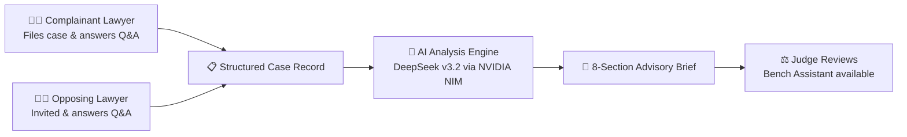

<p align="center">
  
  
  
  
  
  
</p>

<h1 align="center">न्याय · Nyāya</h1>
<p align="center"><strong>AI-Assisted Case Analysis for Indian Consumer Disputes</strong></p>
<p align="center"><em>Clarity for the bench. Structure for the bar.</em></p>

---

> **⚠️ ADVISORY ONLY — NOT LEGAL ADVICE**
>
> Nyāya produces structured analysis to assist human review. It does **not** render verdicts, replace legal counsel, or substitute for judicial reasoning. This is an independent academic project; it is not affiliated with any court, bar council, or government body.

---

## 📋 Table of Contents

- [The Problem](#-the-problem)
- [The Solution](#-the-solution)
- [Key Features](#-key-features)
- [UI Design System](#-ui-design-system)
- [System Architecture](#-system-architecture)
- [Tech Stack](#-tech-stack)
- [Project Structure](#-project-structure)
- [Getting Started](#-getting-started)
- [Environment Variables](#-environment-variables)
- [Deployment to Vercel](#-deployment-to-vercel)
- [Case Categories](#-case-categories)
- [How It Works](#-how-it-works)
- [Design Principles](#-design-principles)
- [Contributing](#-contributing)
- [License](#-license)

---

## 🔍 The Problem

Consumer district commissions in India face immense backlogs:

| Challenge | Impact |
|-----------|--------|
| **Unstructured submissions** | Each party files material in a different format — no enforced schema ensures both sides address the same core questions |
| **Cognitive load on judges** | Judges spend significant time manually synthesizing scattered arguments, identifying disputed facts, and locating applicable precedents |
| **Slow disposal times** | The CPA 2019 targets timely disposal, but many commissions struggle to meet statutory timelines |

No neutral structuring layer exists between lawyers and judges.

---

## 💡 The Solution

**Nyāya** is a neutral case-structuring layer that sits between counsel and the bench:

- **For Lawyers** → Guided question flows aligned to the Consumer Protection Act (CPA) 2019 ensure nothing is missed in submissions
- **For Judges** → An 8-part advisory brief highlighting agreed facts, disputed claims, applicable law, and relevant precedents — entirely traceable to source inputs
- **For the System** → Zero autonomous decision-making. No verdict generation. Explicit caveats on every output.

---

## ✨ Key Features

### Role-Based Workspaces
- **Lawyer Dashboard** — Stats tiles, case table with progress bars, filter/search, file new cases, track matter status
- **Judge Dashboard** — Assigned case queue with priority card, bench assistant chat, brief review workflow

### Dynamic Legal Scaffolding
- 6 CPA case categories (Defective Goods, Deficient Services, Unfair Trade Practices, E-commerce, Misleading Ads, Medical Negligence)
- Each category maps to 6+6 curated evidentiary questions for both parties

### AI Analysis Brief (8 Sections)
1. **Case Summary** — Neutral overview of the dispute
2. **Agreed Facts** — Points both sides concur on
3. **Disputed Facts** — Side-by-side comparison of each party's position
4. **Applicable Law** — Relevant statutes and sections from CPA 2019
5. **Cited Precedents** — From a curated, verified set (no hallucinated citations)
6. **Procedural Flags** — Limitation, jurisdiction, or procedural issues
7. **Evidentiary Gaps** — Missing evidence or unanswered questions
8. **Caveats & Confidence** — Explicit disclaimers and model confidence scoring

### 3-Pane Q&A Interface
- **Left**: question navigator grouped by side (Complainant / Opposing), completion badges, overall progress bar
- **Center**: active question with editable answer area (auto-save on blur) or locked submitted view, AI follow-up notes
- **Right**: parties panel, case details, Nyāya assistant hint

### 3-Pane Brief Viewer
- **Left TOC**: numbered section list with confidence dots, confidence ring display, bench action buttons (Acknowledge / Flag / Export PDF)
- **Center**: section body with section-type-aware rendering (prose, checklist, side-by-side, law clauses, precedent cards, procedural flags grid), private judge notes
- **Right Source Viewer**: model trace, statute text, or cited precedent with key paragraph

### 4-Step New Case Wizard
- **Step 0** — Category selection (6 cards with icon + name + desc), Q&A template preview
- **Step 1** — Parties & metadata (2-col grid: names, addresses, jurisdiction, claim, relief)
- **Step 2** — Invite opposing counsel (email, Bar ID, deadline, email preview panel)
- **Step 3** — Review & confirm (summary grid, advisory acknowledgment, file CTA)

### Judge Bench Assistant
- Interactive Q&A powered by DeepSeek v3.2 for case-specific synthesis
- Grounded only in submitted material — never fabricates

---

## 🎨 UI Design System

Nyāya uses a fully custom CSS design system (no Tailwind in the app shell) with a lawyer-grade aesthetic built for long-form document work.

### Design Tokens

```css
/* Navy palette */
--navy-950: #020c1b;   --navy-900: #0a1f44;   --navy-800: #0f2d5e;
--navy-700: #133578;   --navy-600: #1a4491;

/* Warm paper base */
--paper: #fbfaf6;      --ink-1: #1a1915;      --ink-2: #2e2d29;

/* Semantic aliases (theme-aware) */
--bg: var(--paper);    --surface: #ffffff;
--primary: var(--navy-900);
--serif: 'Fraunces', Georgia, serif;
--mono: 'JetBrains Mono', monospace;
```

### App Shell

```
┌─ Topbar (56px) ─────────────────────────────────────────────┐
│  Chakra mark + Nyāya   │   Breadcrumb   │   User chip       │
├─ Sidebar (240px) ───────┬───────────────────────────────────┤
│  Nav links (role-based) │   Content area (scrollable)       │
│  Advisory pill footer   │   .page or .qa-shell / .brief-    │
│                         │   shell (full-height 3-pane)      │
└─────────────────────────┴───────────────────────────────────┘
```

### Key CSS Classes

| Class | Description |
|-------|-------------|
| `.app` | Root grid: `56px 1fr` rows, `100vh` height |
| `.main` | Sidebar + content grid: `240px 1fr` |
| `.qa-shell` | 3-pane Q&A: `280px 1fr 320px` |
| `.brief-shell` | 3-pane brief: `320px 1fr 1fr` |
| `.signin` | Split auth: `1.1fr 1fr` |
| `.page` | Padded content container with `max-width: 1400px` |
| `.card`, `.stat` | Surface cards and metric tiles |
| `.tbl` | Full-width data table with hover rows |
| `.badge` | Status badges with dot indicator and tone variants |
| `.btn` | Button system (ghost / primary / sm / lg) |
| `.stepper` | Step-pip progress indicator |
| `.cat-grid`, `.cat-card` | Category selection grid |
| `.bar` | Progress bar with color variants |

### Ashoka Chakra Brand Mark

A reusable `<Chakra />` SVG component (`components/ui/chakra.tsx`) renders a 24-spoke Ashoka Chakra at configurable size and stroke weight. Used in topbar, sign-in art panel, and as decorative watermarks.

---

## 🏗 System Architecture

```
┌───────────────────────────────────────────────────────────┐
│                     Client (Browser)                       │
│  Next.js 15 App Router  ·  React 19  ·  Custom CSS DS     │
│  Convex React SDK  ·  Clerk client hooks                  │
└──────────────┬──────────────────────┬─────────────────────┘
               │                      │
               ▼                      ▼
┌──────────────────────┐  ┌─────────────────────────────────┐
│        Clerk         │  │      Convex (BaaS)              │
│  ┌────────────────┐  │  │  ┌────────────────────────────┐ │
│  │ Google OAuth   │  │  │  │  Realtime Database          │ │
│  │ Email/password │  │  │  │  Serverless Functions        │ │
│  │ Session sync   │  │  │  │  Vector Search (768-dim)     │ │
│  └────────────────┘  │  │  │  File Storage                │ │
└──────────────────────┘  │  └────────────────────────────┘ │
                          └──────────┬──────────────────────┘
                                     │
                                     ▼
                          ┌─────────────────────┐
                          │   NVIDIA NIM API     │
                          │   DeepSeek v3.2      │
                          │   (JSON-enforced)    │
                          └─────────────────────┘
```

---

## 🛠 Tech Stack

| Layer | Technology | Purpose |
|-------|-----------|---------|
| **Framework** | [Next.js 15](https://nextjs.org/) (App Router + Turbopack) | Server components, API routes, SSR |
| **UI** | [React 19](https://react.dev/) | Component rendering |
| **Styling** | Custom CSS design system + [shadcn/ui](https://ui.shadcn.com/) | Navy/paper lawyer aesthetic, utility classes |
| **Database** | [Convex](https://convex.dev/) | Realtime DB, serverless functions, vector search, file storage |
| **LLM** | [NVIDIA NIM](https://build.nvidia.com/) (DeepSeek v3.2) | Brief generation, judge synthesis, JSON-enforced outputs |
| **Auth** | [Clerk](https://clerk.com/) | Google OAuth + email/password |
| **Validation** | [Zod](https://zod.dev/) | Runtime type checking |

---

## 📁 Project Structure

```
ai.judge/
├── README.md
└── nyaya/                     ← Main Next.js application
    ├── app/
    │   ├── globals.css         ← Full custom design system (tokens + utility classes)
    │   ├── (marketing)/        ← Landing page
    │   ├── (auth)/
    │   │   ├── sign-in/        ← Split-panel: role selector cards + form
    │   │   └── sign-up/        ← Split-panel: registration form
    │   └── (app)/
    │       ├── layout.tsx      ← App shell: topbar + sidebar (role-based nav)
    │       ├── lawyer/
    │       │   ├── dashboard/  ← Stats tiles + case table + activity feed
    │       │   └── cases/
    │       │       ├── new/    ← 4-step case filing wizard
    │       │       └── [caseId]/ ← 3-pane Q&A interface
    │       └── judge/
    │           ├── dashboard/  ← Stats + case queue + priority card + bench assistant
    │           └── cases/
    │               └── [caseId]/ ← 3-pane analysis brief viewer
    ├── components/ui/
    │   └── chakra.tsx          ← Ashoka Chakra SVG brand mark (24 spokes)
    ├── convex/                 ← Convex backend
    │   ├── schema.ts           ← Database schema (7 tables)
    │   ├── cases.ts            ← Case CRUD
    │   ├── qa.ts               ← Q&A session management
    │   ├── analysis.ts         ← Brief generation orchestration
    │   ├── judge.ts            ← Judge-specific queries
    │   ├── precedents.ts       ← Precedent management & vector search
    │   ├── users.ts            ← User management
    │   └── audit.ts            ← Audit logging
    └── lib/
        ├── authRoles.ts        ← Clerk role normalization and dashboard routing
        ├── llm.ts              ← NVIDIA NIM / DeepSeek integration
        ├── caseCategories.ts   ← CPA categories & Q&A question templates
        └── prompts/            ← LLM system prompts
```

---

## 🚀 Getting Started

### Prerequisites

- **Node.js** ≥ 18.17
- **pnpm** (recommended) or npm
- [NVIDIA API Key](https://build.nvidia.com/) for DeepSeek v3.2
- [Convex account](https://dashboard.convex.dev)

### 1. Clone & Install

```bash
git clone https://github.com/Nipunjaiswal442/ai.judge.git
cd ai.judge/nyaya
pnpm install
```

### 2. Configure Environment

```bash
cp .env.example .env.local
```

Populate `.env.local` with the required variables (see [Environment Variables](#-environment-variables)).

### 3. Initialize Convex

In a **separate terminal**, start the Convex dev server to sync your database schema and push serverless functions:

```bash
npx convex dev
```

> On first run, you'll be prompted to log in to Convex and select/create a project.

### 4. Run the Dev Server

```bash
pnpm dev    # Uses Turbopack for near-instant HMR
```

Open [http://localhost:3000](http://localhost:3000) in your browser.

---

## 🔐 Environment Variables

Create a `.env.local` file in the `nyaya/` directory:

```bash
# ── Convex ──
NEXT_PUBLIC_CONVEX_URL="https://your-convex-url.convex.cloud"

# ── Clerk ──
NEXT_PUBLIC_CLERK_PUBLISHABLE_KEY="pk_test_or_live_..."
CLERK_SECRET_KEY="sk_test_or_live_..."

# ── NVIDIA AI (DeepSeek v3.2 via NIM) ──
NVIDIA_API_KEY="nvapi-your-key-here"
```

### Vercel-Specific Variables

| Variable | Required | Notes |
|----------|----------|-------|
| `NEXT_PUBLIC_CLERK_PUBLISHABLE_KEY` | ✅ | Clerk publishable key for the deployed instance |
| `CLERK_SECRET_KEY` | ✅ | Clerk secret key for server-side account sync |
| `CONVEX_DEPLOY_KEY` | ✅ | Required if using `npx convex deploy` in build step |

---

## 🌐 Deployment to Vercel

1. **Connect** your GitHub repository to [Vercel](https://vercel.com)
2. **Set Root Directory** to `nyaya` (critical — the Next.js app is inside a subfolder)
3. **Add all environment variables** listed above in Vercel Project Settings
4. **Set Build Command** to:
   ```
   npx convex deploy && next build
   ```
5. **Deploy!** 🚀

> ⚠️ If you skip setting `NEXT_PUBLIC_CONVEX_URL`, `NEXT_PUBLIC_CLERK_PUBLISHABLE_KEY`, or `CLERK_SECRET_KEY`, sign-in will fail in production.

---

## 📂 Case Categories

Nyāya supports 6 consumer dispute categories under the CPA 2019, each with curated questions for both sides:

| Category | Complainant Questions | Opposing Questions |
|----------|:--------------------:|:------------------:|
| Defective Goods | 6 | 6 |
| Deficient Services | 6 | 6 |
| Unfair Trade Practices | 6 | 6 |
| E-commerce Disputes | 6 | 6 |
| Misleading Advertisements | 6 | 6 |
| Medical Negligence (Consumer) | 6 | 6 |

---

## ⚙️ How It Works



| Step | Actor | What Happens |
|------|-------|-------------|
| **1. File** | Complainant Lawyer | Selects category via card grid, enters party details in 2-col form, optionally invites opposing counsel — system auto-generates case ID. |
| **2. Q&A** | Both Lawyers | Each side works through 6 guided questions in a 3-pane interface. Answers auto-save on blur. Neither side sees the other's draft until submission. |
| **3. Brief** | AI Engine | Once both sides submit, the complainant triggers brief generation. DeepSeek v3.2 produces an 8-section JSON brief with confidence scoring. |
| **4. Review** | Judge | Reviews the 3-pane brief (TOC → section body → source viewer), uses Bench Assistant for follow-up, acknowledges to advance the case. |

---

## 🧭 Design Principles

| Principle | Implementation |
|-----------|---------------|
| **Advisory posture** | Explicit, un-hideable caveats on every AI output. Zero verdict generation. Confidence ring on brief TOC. |
| **Traceability** | Every AI claim links to raw lawyer submissions or curated precedents. Source viewer panel in brief viewer. |
| **Neutrality** | Platform serves both sides equally. Neither party sees the other's draft until submission. |
| **Auditability** | All user actions logged with timestamps for transparency. |
| **Human-in-the-loop** | Judges make all decisions. AI structures information, never recommends outcomes. Acknowledge button is the only judicial action. |
| **Accessible density** | Custom CSS design system — navy/paper palette, Fraunces serif for headings, JetBrains Mono for case IDs. Dense tables with hover states, not cards everywhere. |

---

## 🤝 Contributing

This is an open academic repository. Contributions are welcome!

1. **Fork** the repository
2. **Create** your feature branch (`git checkout -b feature/amazing-feature`)
3. **Commit** your changes (`git commit -m 'Add amazing feature'`)
4. **Push** to the branch (`git push origin feature/amazing-feature`)
5. **Open** a Pull Request

For bugs and suggestions, please use the [Issues](https://github.com/Nipunjaiswal442/ai.judge/issues) tab.

---

## 📄 License

This project is open source and available for academic and educational purposes.

---

<p align="center">
  <br/>
  <strong>Built with ❤️ by <a href="https://github.com/Nipunjaiswal442">Nipun Jaiswal</a></strong>
  <br/><br/>
  <sub>न्यायमूलं प्रजासुखम् — The happiness of the people is rooted in justice.</sub>
</p>
